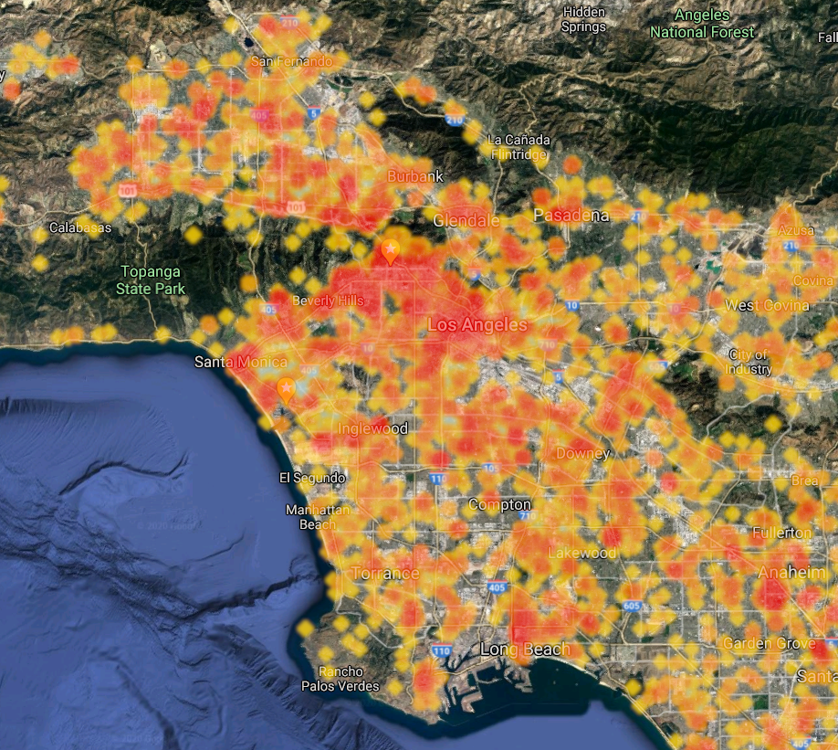

Among English speakers, the phrase "Oh my God" might be the most frequent way to express surprise with soft blasphemy. In this first paper of the Computational Social Science Lab Holiday Paper Series, we look into how "Oh my God" became popular with the [TV series Friends](https://www.imdb.com/title/tt0108778/) by analyzing the scripts of the series and other datsets of spoken and written expression across media and languages. We also study the demographics of who says it through Twitter data and explore how AI language models have learned to say it.

The expression "Oh my God" is specially prevalent in US television as part of the valleyspeak sociolect [@noauthor_valleyspeak_2020] (see any episode of "Keeping up with the Kardashians" to have an idea). Beyond the OMG expression, valleyspeak is characterized by the frequent use of *uptalk*, a speech pattern in which sentences end in a question-like tone, *vocal fry*, another speech pattern in which utterances end in a vibrating sound similar to what a goat makes when queezed, and the extreme use of the word *like* as a filler word. While original examples of valleyspeak originate in the San Fernando Valley in California, it can now be heard across the US and specially in mass media. 

"Oh my God" is the most characteristic reaction of the characters of Friends, which is one of the most successful sitcoms in history, even more than 15 years after it ended [@TheEconomist_2019]. The [Honest Trailer of the series](https://youtu.be/oqDSrMK_Gyg?t=346) points out how frequently the characters of the series react with this phrase.  For example, Rachel says it several times in just [one scene](https://www.youtube.com/watch?v=x7pPxerXmVo) in reaction to the sudden appearance of a pidgeon in her kitchen. The phrase is so typical of the series that it has even motivated a data science blog post about which Friends characters use it the most [@loscalzo_2018]. Beyond this phrase, Friends is becoming a common example for popular data science analyses, including social network analysis [@Albright2015;@sahakyan_one_2019], finding the most popular character [@sohoye_one_2019], and of course, sentiment analysis [@bhattacharyya_sentiment_2019].

Our aim with this article is to understand the popularity and meaning of "Oh my God", especially in relation with the TV series Friends. We will start by analyzing the scripts of Friends, comparing the use of "Oh my God" in Friends with contemporary TV shows and movies. We then continue by analyzing the expression through Google Books, inspecting what could have been the role of Friends in the use of the phrase and how it compares to similar phrases in other languages. We then analyze the current use of the phrase in social media through the analysis of a Twitter dataset, paying special attention to its use across genders and states in the US. Finally, we explore how AI language models like BERT and GPT-2 have learned the phrase and which meanings we can associate with the phrase through these models. The code, data, and detailed results of all these analyses can be found online in our [github repository](https://github.com/dgarcia-eu/Friends_HPS2020).

```{r, echo=FALSE, message=FALSE, results='hide', cache=FALSE, warning=FALSE}
library(dplyr)
Sys.setlocale("LC_TIME", "en_US.UTF-8")
library(ggplot2)
library(htm2txt)
library(stringr)
library(ngramr)
library(extrafont)
library(forecast)
library(ggpubr)
library(patchwork)
library(usmap)
library(wordcloud)
library(RWeka)
library(tm)
options(scipen=20)

# library(ragg)

# ragg_png = function(..., res = 192) {
#   ragg::agg_png(..., res = res, units = "in")
# }
# knitr::opts_chunk$set(dev = "ragg_png", fig.ext = "png")

knitr::opts_chunk$set(dev = "cairo_pdf")

# knitr::opts_chunk$set(dev = "png", dev.args = list(type = "cairo-png"))
```


```{r, echo=FALSE, message=FALSE, results='hide', cache=FALSE}
# Friends theme from: https://rstats-tips.net/2019/08/31/custom-fonts-in-ggplot2-and-latex/
# Font credit: https://www.dafont.com/gabriel-weiss-friends.font

loadfonts(device = "postscript")
# run the following command once
# font_import()

friends.theme <- theme_bw() +
  theme(panel.border = element_rect(colour="#0062B9"),
        panel.background = element_rect(fill="white"),
#        panel.grid.major = element_line(colour="#004290"),
#        panel.grid.minor = element_line(colour="#77ABE0"),
        strip.background = element_rect(colour="#0062B9", fill="#0062B9"),
        strip.text       = element_text(colour="white"),
        text=element_text(size=16, family="Gabriel Weiss' Friends Font", face="plain"),
        legend.text = element_text(size=10),
        legend.position="bottom"
  )

friends.colors <- c("#02B1e6", "#E81D22", "#F9BC15", "#8015f9", "#20e81d", "#e64602")
#theme.colors <- c(friends.colors, friends.colors)
update_geom_defaults("bar", list(colour = "#004290", fill="#77ABE0"))

theme_set(friends.theme)
```

# The one with the "Oh my God"


```{r, echo=FALSE, message=FALSE, cache=TRUE}
#download.file("https://github.com/fangj/friends/archive/master.zip", destfile="friends.zip")
#unzip("friends.zip")
df <- NULL
listfiles <- list.files(path = "friends-master/season", full.names = T)
for (filename in listfiles)
{
  if (filename != "0423uncut.html" & filename != "07outtakes.html")
  {
    season <- as.numeric((substr(strsplit(filename, "/")[[1]][3], 1,2)))
    text <- tryCatch(
      {
        content <- gettxt(filename)
        iconv(content, from="UTF-8", to="ASCII", sub = "")
      },
      error=function(e){
        content <- gettxt(filename, encoding = "latin1")
        iconv(content, from="latin1", to="ASCII", sub = "")
      })
    text <- tolower(text)
    
    text.corpus <- tm::VCorpus(VectorSource(text))
    text.corpus <- tm::tm_map(text.corpus,  content_transformer(removePunctuation))
    tdm <- tm::TermDocumentMatrix(text.corpus)
    total <- sum(tdm$v)-2
    df <- rbind(df, data.frame(season, Nwords=total, omg=str_count(text,
                  "oh[:punct:]*\\s*my[:punct:]*\\s*[:punct:]*(god)")))
  }
}

df %>% group_by(season) %>% summarize(omg=sum(omg), N=n(), Nwords=sum(Nwords)) -> fdf
fdf$year <- fdf$season + 1994
```

We dowloaded the scripts of all Friends episodes from this [Github repository](https://github.com/fangj/friends) and processed the text, converting it to lower case and matching the regular expression ```"oh[:punct:]*\\s*my[:punct:]*\\s*[:punct:]*(god)"```. This regular expression counts the instances of "Oh my God" with a soft rule that allows various punctuation and spaces in between words, but we do not count other variations such as "Oh my fricking God". We denote the count of matches of the regular expression as *OMG*, defining this way the unit of our analyses. In total we found `r sum(fdf$omg)` OMG the `r length(listfiles)` episodes of the series (double episodes are merged into single files). After counting words with the [tm package](https://cran.r-project.org/web/packages/tm/index.html) [@tm1;@tm2], we found that Friends has `r round(sum(fdf$omg)/sum(fdf$Nwords)*1000000,1)` instances of OMG per million trigrams (i.e. sequences of three words).

```{r episodes, echo=FALSE, message=FALSE, cache=TRUE, fig.cap="OMG per episode in each season of Friends", fig.align='center'}
plt <- ggplot(data = fdf, aes(x=season, y=omg/N))
plt <- plt +   geom_bar(stat="identity") + ylab("OMG per episode") +
  scale_x_continuous(breaks=df$season) + scale_y_continuous(limits = c(0,7))

plt

omgpermillion <- sum(fdf$omg)/sum(fdf$Nwords)*1000000

```

Figure \@ref(fig:episodes) shows the OMG per episode in each season of the series, There is a tendency to more OMG over the lifetime of the series, from less than 3 OMG per episode in the first season to more than 6 in the last one. To compare Friends to contemporary TV shows and movies we applied the same analysis to the 2020 edition of the Corpus Of Contemporary American English (COCA) [@davies2010corpus]. In our [github repository](https://github.com/dgarcia-eu/Friends_HPS2020) we share the final yearly counts of our analyses, as we are not allowed to share the raw text of the corpus by the terms to access it.

```{r, echo=F, eval=F}
df <- NULL
for (source in c("tvm", "spok"))
{
  print(source)
  for (year in seq(1990,2019))
  {
    print(year)
    text <- readLines(paste0("COCA/text_",source,"_",year,".txt"), skipNul = TRUE)
    textA <- paste(text, collapse="")
    textA <- tolower(textA)
    omgcount <- str_count(textA, "oh , my god") +  str_count(textA, "oh my god")
    
    removeURL <- function(x) gsub("http:[[:alnum:]]*", "", x)
    text.corpus <- tm::VCorpus(VectorSource(text))
    text.corpus <- tm::tm_map(text.corpus,  content_transformer(removeURL))
    text.corpus <- tm::tm_map(text.corpus,  content_transformer(removePunctuation))
    text.corpus <- tm::tm_map(text.corpus, content_transformer(tolower))
    
    trigramTdm <- tm::TermDocumentMatrix(text.corpus)
    total <- sum(trigramTdm$v)-2
    df <- rbind(df, data.frame(year, omgcount, total, source))
  }
}
write.csv(df, file="COCA.csv", row.names = F)
```


```{r tvm, echo=F, fig.width=7, fig.height=3, cache=TRUE, message=F, fig.cap="OMG per million trigrams in TV and Movie subtitles of the COCA corpus.", fig.align='center'}
df <- read.csv("COCA.csv")
plt <- ggplot(df[df$source=="tvm",], aes(x=year, y=omgcount/total*1000000)) + geom_line() + ggtitle("TV and Movie subtitles") +ylab("OMG per million")+  theme(plot.margin=unit(c(0.5,0.5,0.5,0.5),"cm"))

plt
f <- df$source=="tvm" & (df$year >= 1994 & df$year <= 2004)
omgTV <- sum(df$omgcount[f])/sum(df$total[f])*1000000
```

Figure \@ref(fig:tvm) shows the yearly frequency of OMG per million trigrams in the TV and movie subtitles part of the COCA corpus. While it is clear that the phrase is very popular in US entertainment and its popularity is increasing, Friends had many more OMG than contemporary TV and movies. Friends had approximately `r round(omgpermillion,0)` OMG per million trigrams, which is `r round(omgpermillion/omgTV,2)` times what you would find on the typical TV shows and movies between 1994 and 2004 (300-400 OMG per million).

```{r spoken, echo=F, fig.width=7, fig.height=3, cache=TRUE, message=F, fig.cap="OMG per million trigrams in spoken transcripts of the COCA corpus.", fig.align='center'}
df <- read.csv("COCA.csv")
plt <- ggplot(df[df$source=="spok",], aes(x=year, y=omgcount/total*1000000)) + geom_line() + ggtitle("Spoken") + ylab("OMG per million")+  theme(plot.margin=unit(c(0.5,0.5,0.5,0.5),"cm"))
plt
```

Figure \@ref(fig:spoken) shows the yearly frequency of OMG per million trigrams in the transcripts of unscripted spoken TV shows of the COCA corpus. While the frequency is about `r round(sum(df$omgcount[df$source=="tvm"])/sum(df$omgcount[df$source=="spok"]),2)` times higher in TV and movie subtitles than in these spoken transcripts, the increasing tendency is present too. Although the source of both corpora is TV, the spoken transcripts come from talk shows and other kinds of unscripted shows. Mass media scripts seem to use "Oh my God" as a way to emphasize and elicit surprise reactions in the audience, which does not happen so naturally in live unscripted television.

# The one with all those books

The frequency of OMG in both scripted and unscripted spoken language in TV shows and movies has been steadily increasing since the 1990s, but to test if Friends might have affected the tendency to use the phrase, we need to look at a longer time period. Inspiried by the trend previously observed in [@loscalzo_2018], we study the frequency of OMG in Google Books, one of the most comprehensive records of human written communication over several centuries and languages [@michel2011quantitative]^[We would say that our Google Books analysis an example of *culturomics*, but the term seems to be used nowadays more often to talk about gut bacteria than about culture product analysis]. We use the [ngramr R package](https://github.com/seancarmody/ngramr) [@ngramr] to query the 2019 dataset of English fiction books to avoid known problems with non-fiction texts [@pechenick2015characterizing]. We also only analyze frequencies since 1900 to avoid Optical Character Recognition errors like mistaking a [long *s* for an *f* in 1600s and 1700s texts.](https://books.google.com/ngrams/graph?content=fuck&year_start=1500&year_end=2019)


```{r, echo=F, fig.width=7, fig.height=3, cache=TRUE, warning=FALSE, results="hide", message=FALSE}
books <- ngram(phrases="oh my god", corpus="eng_fiction_2019", 
               year_start=1900, smoothing=0, case_ins=TRUE)
books$year <- books$Year
books %>% group_by(year) %>% summarise(hits=sum(Frequency)) -> booksdf

booksdf$Y <- booksdf$hits
booksdf$dataset <- "Google Books"
fdf$Y <- fdf$omg/fdf$N
fdf$dataset <- "Friends"
plotdf <- data.frame(year=c(booksdf$year, fdf$year), Y=c(booksdf$Y*1000000, fdf$Y), dataset=c(booksdf$dataset, fdf$dataset))
```


```{r books1, echo=F, fig.width=7, fig.height=3, cache=TRUE, fig.cap="OMG per episode in Friends each season and yearly OMG per million trigrams in Google Books.", fig.align='center' , warning=FALSE}
plt <- ggplot(data = plotdf, aes(x=year, y=Y, group=dataset, color=dataset))
plt <- plt + geom_line() + ylab("OMG per million") + theme(legend.position = c(0.2,0.8), legend.title = element_blank()) + scale_color_manual(values=c("darkred","cornflowerblue"))
plt
```

Figure \@ref(fig:books1) shows the frequency of OMG per million trigrams in Google Books with the number of OMG per episode of the ten seasons of friends superimposed. The frequency of OMG in books has consistently increased over more than a century. This rate apparently accelerated after Friends came out. Could Friends be responsible for additional growth in the frequency of OMG in books?

```{r books2, echo=F, fig.width=7, fig.height=3, cache=TRUE, fig.cap="OMG per million trigrams in Google books (solid black) and time series model prediction (dashed blue). The vertical red line indicates the year of the first season.", fig.align='center'}
Ty <- 1995
model <- auto.arima(log(1000000*booksdf$Y[booksdf$year<Ty]), ic="bic")
fcst<-forecast(model, h = max(booksdf$year) - Ty+1)

fcstdf <- data.frame(year = Ty-1+seq(1,length(fcst$mean)), pred=fcst$mean)

plt <- ggplot(data = booksdf, aes(x=year, y=1000000*Y)) + 
  geom_line() + ylab("OMG frequency") + 
  geom_vline(xintercept = Ty, lty=2, col="red") + 
  geom_line(data=fcstdf, aes(y=exp(pred), x=year), col="blue", lty=2)
plt

change <- 100*(sum(1000000*booksdf$Y[booksdf$year>=Ty])-sum(exp(fcstdf$pred)))/sum(exp(fcstdf$pred))
```

We tested the effect of Friends on the frequency of OMG in books with a causal inference design. First, we fit an ARIMA time series model of the log-transformed OMG frequency up to 1994, the year of the first season of Friends. We choose the model size by minimizing the BIC with the *auto.arima* function of the [forecast R package](https://cran.r-project.org/web/packages/forecast/index.html) [@forecast1;@forecast2]. The resulting model has an $R^2$ of `r round(1-var(model$residuals)/var(log(1000000*booksdf$Y[booksdf$year<Ty])),2)`
 for log-transformed values and of `r round(1-var(exp(model$residuals))/var(1000000*booksdf$Y[booksdf$year<Ty]),2)` for raw frequencies, with a moving average term and a positive drift term that explains the exponentially increasing shape of Figure \@ref(fig:books1).
 
Figure \@ref(fig:books2) shows the forecasted values of the model since 1995 versus the empirical frequency of OMG in Google Books.
From 1995, there has been an additional `r round(change,2)`% OMGs compare to what the null model predicts.
This is an impressive surplus of OMG after Friends started, but we should not fool ourselves with such causal inference arguments. 
This could have been Friends or a coincidence with another influential source, for example South Park's "oh my God, they killed Kenny". What is clear is that Friends captured an increasing frequency of OMG and that, after the series, this frequency in books has grown even faster.

```{r booksmodel, echo=F, fig.width=7, fig.height=3, cache=TRUE, fig.cap="Model projection of OMG frequency per trigram from 2000. Light blue lines show 90\\% prediction intervals. The horizontal green line marks the 33\\% frequency line. The vertical dashed red line shows where predictions start.", warning=FALSE, fig.align='center'}
Ty <- 2000
model <- auto.arima(log(booksdf$Y[booksdf$year>=Ty]), ic="bic")
Ty <- max(booksdf$year)

fcst<-forecast(model, h = 2320 - Ty+1, level = 0.9)
fcstdf <- data.frame(year = Ty-1+seq(1,length(fcst$mean)), pred=fcst$mean, low=as.vector(fcst$lower), high=as.vector(fcst$upper))

plt <- ggplot(data = fcstdf, aes(x=year, y=exp(pred))) + 
  geom_line() + ylab("OMG frequency") + 
  geom_vline(xintercept = Ty, lty=2, col="red") + 
  geom_line(col="blue")+
  geom_line(data = fcstdf, col=rgb(0,0,1,0.5), aes(y=exp(low))) +
  geom_line(data = fcstdf, col=rgb(0,0,1,0.5), aes(y=exp(high))) +
  geom_hline(yintercept=0.33, col="green") + 
  geom_line(data=booksdf, aes(x=year, y=Y))+ 
  scale_y_log10(limits =c(min(booksdf$Y),0.33))

plt
```

What does this tell us about the future of the phrase "Oh my God"? To forecast trends, we apply the Complexity Science™ method of fitting straight lines to log scales. Figure \@ref(fig:booksmodel) shows the empirical frequency in Google Books with a vertical logarithmic scale and the predictions of the model three centuries into the future after fitting it with the data since the year 2000. This suggest that approximately by the year `r fcstdf$year[which(exp(fcstdf$pred)>0.33)[1]]`, all text in books will be composed of entirely "Oh my God". Our data-driven insights allow us to code a model that writes English fiction literature like the one we will see in the 23rd century:

```{r, results="asis", echo=T, eval=F}
for (i in (seq(1,30)))
{
  cat("Oh my God")
  rnd <- runif(n=1, min=0, max=1)
  if (rnd <0.4)
    cat("! ")
  if ((rnd >=0.4) & (rnd <0.8))
    cat(". ")
  if (rnd >=0.8)
    cat("? ")
  }
```

An example of the output of the model can be found here:

<span style="font-family: 'Gabriel Weiss\' Friends Font'">
```{r, results="asis", echo=F}
for (i in (seq(1,30)))
{
  cat("Oh my God")
  rnd <- runif(n=1, min=0, max=1)
  if (rnd <0.4)
    cat("! ")
  if ((rnd >=0.4) & (rnd <0.8))
    cat(". ")
  if (rnd >=0.8)
    cat("? ")
  }
```
</span>

# The one with the other languages

Given the international success of Friends, could this be happening in other languages too? We use the fact that Google Books covers eight languages to explore this possibility. We tried to find the closest equivalents of "my God", dropping the "oh" for better comparability across languages: "Dios mío" in Spanish, "mio Dio" in Italian, "mon Dieu" in French, and "mein Gott" in German. Adviced by native-speaking friends of us, we also included "天啊" for Chinese, "Боже мой" for Russian, and  "אלוהים אדירים" for Hebrew, even though none of the authors speak these three languages^[We thank Simon Schweighofer, Wenjuan Liang, Olga Antsiferova, and Amit Goldenberg for helping with our language handicaps].

```{r cache=TRUE, fig.cap="Other languages", warning=FALSE, echo=F, message=F}
books <- ngram(phrases="Dios mío", corpus="spa_2019", 
               year_start=1900, smoothing=0, case_ins=TRUE)
books$year <- books$Year
books %>% group_by(year) %>% summarise(hits=sum(Frequency)) -> booksdf
booksdf$Y <- booksdf$hits*1000000
booksdf$language <- "Spanish"

nbooks <- ngram(phrases="mio dio", corpus="ita_2019", 
               year_start=1900, smoothing=0, case_ins=TRUE)
nbooks$year <- nbooks$Year
nbooks %>% group_by(year) %>% summarise(hits=sum(Frequency)) -> nbooksdf
nbooksdf$Y <- nbooksdf$hits*1000000
nbooksdf$language="Italian"
booksdf <- rbind(booksdf, nbooksdf)

nbooks <- ngram(phrases="mon Dieu", corpus="fre_2019", 
               year_start=1900, smoothing=0, case_ins=TRUE)
nbooks$year <- nbooks$Year
nbooks %>% group_by(year) %>% summarise(hits=sum(Frequency)) -> nbooksdf
nbooksdf$Y <- nbooksdf$hits*1000000
nbooksdf$language="French"
booksdf <- rbind(booksdf, nbooksdf)

nbooks <- ngram(phrases="my God", corpus="eng_2019", 
               year_start=1900, smoothing=0, case_ins=TRUE)
nbooks$year <- nbooks$Year
nbooks %>% group_by(year) %>% summarise(hits=sum(Frequency)) -> nbooksdf
nbooksdf$Y <- nbooksdf$hits*1000000
nbooksdf$language="English"
booksdf <- rbind(booksdf, nbooksdf)

nbooks <- ngram(phrases="mein Gott", corpus="ger_2019", 
               year_start=1900, smoothing=0, case_ins=TRUE)
nbooks$year <- nbooks$Year
nbooks %>% group_by(year) %>% summarise(hits=sum(Frequency)) -> nbooksdf
nbooksdf$Y <- nbooksdf$hits*1000000
nbooksdf$language="German"
booksdf <- rbind(booksdf, nbooksdf)

nbooks <- ngram(phrases="天啊", corpus="chi_sim_2019", 
               year_start=1900, smoothing=0)
nbooks$year <- nbooks$Year
nbooks %>% group_by(year) %>% summarise(hits=sum(Frequency)) -> nbooksdf
nbooksdf$Y <- nbooksdf$hits*1000000
nbooksdf$language="Chinese"
booksdf <- rbind(booksdf, nbooksdf)

nbooks <- ngram(phrases="Боже мой", corpus="rus_2019", 
               year_start=1900, smoothing=0, case_ins=TRUE)
nbooks$year <- nbooks$Year
nbooks %>% group_by(year) %>% summarise(hits=sum(Frequency)) -> nbooksdf
nbooksdf$Y <- nbooksdf$hits*1000000
nbooksdf$language="Russian"
booksdf <- rbind(booksdf, nbooksdf)

nbooks <- ngram(phrases="אלוהים אדירים", corpus = "heb_2019", 
               year_start=1900, smoothing=0, case_ins=TRUE)
nbooks$year <- nbooks$Year
nbooks %>% group_by(year) %>% summarise(hits=sum(Frequency)) -> nbooksdf
nbooksdf$Y <- nbooksdf$hits*1000000
nbooksdf$language="Hebrew"
booksdf <- rbind(booksdf, nbooksdf)
```

```{r booksplots, fig.width=7, fig.height=6, cache=TRUE, fig.cap="Frequency of terms equivalent to \"my God\" in the eight languages of Google Books.", fig.align='center', warning=FALSE, echo=F}
booksdf %>% filter(language %in% c("English", "French", "Spanish", "German")) -> sdf
plt1 <- ggplot(data = sdf, aes(x=year, y=Y, color=language, group=language))
plt1 <- plt1 + geom_line() + ylab("frequency") + theme(legend.position = c(0.7,0.7), legend.title = element_blank()) 

booksdf %>% filter(!language %in% c("English", "French", "Spanish", "German")) -> sdf
plt2 <- ggplot(data = sdf, aes(x=year, y=Y, color=language, group=language))
plt2 <- plt2 + geom_line() + ylab("frequency") + theme(legend.position = c(0.65,0.7), legend.title = element_blank()) 

plt1 / plt2
```

Figure \@ref(fig:booksplots) shows the frequency of the equivalent of "my God" in English and the other seven languages. All languages except Chinese and Hebrew show sharp increases around 2008, coinciding with the growth of social media as a major communication mechanism. The pattern for English is softer, with a tendency to grow dating smoothly few decades back, and Russian also shows high historical frequency, especially around World War II. A common pattern in all languages is that their historical peak is in the last decade, showing that the overall tendency to use the phrase is growing beyond the English-speaking world.

# The one with the tweets

```{r , echo=F}
genderdf <- read.csv("Twitter/TwitterGender.csv")
```

How is "oh my God" being used in social media nowadays? To explore this, we used our \$14000/year subscription to Crimson Hexagon^[Gently payed by other serious research projects]. We analyzed tweets from
2010-09-01 to 2020-08-30 that were identified by Crimson Hexagon as written in English by users living in the US and with an identifiable gender. Our analysis includes a total of `r sum(genderdf$total)` tweets with gender and among them `r sum(genderdf$count)` contain "oh my God" or "OMG".

```{r twittergender, fig.width=7, fig.height=3, cache=TRUE, message=F, echo=F, fig.cap="Donut plots of gender in tweets that contain OMG and in all tweets.", fig.align='center'}

plotdf <- data.frame(gender=c("male","female"), count=genderdf$count)
p1 <- ggdonutchart(plotdf, "count", label ="gender", fill="gender", palette=c(rgb(0,0,1,0.5),rgb(1,0,0,0.5)), lab.pos ="in", font.family = "Gabriel Weiss' Friends Font", ggtheme = friends.theme)+ggtitle("OMG tweets")+ theme(legend.position = "none", plot.title = element_text(hjust = 0.5))
omgR <- genderdf$count[genderdf$gender=="female"]/sum(genderdf$count)

plotdf <- data.frame(gender=c("male","female"), count=genderdf$total)
p2 <- ggdonutchart(plotdf, "count", label ="gender", fill="gender", palette=c(rgb(0,0,1,0.5),rgb(1,0,0,0.5)), lab.pos = "in", font.family = "Gabriel Weiss' Friends Font", ggtheme = friends.theme)+ggtitle("all tweets")+ theme(legend.position = "none", plot.title = element_text(hjust = 0.5))
totR <- genderdf$total[genderdf$gender=="female"]/sum(genderdf$total)

p1+p2
```

Figure \@ref(fig:twittergender) shows the fractions of tweets posted by users of each gender for tweets that include a form of OMG and for all tweets. `r 100*round(omgR,4)`% of OMG tweets are posted by women, while `r 100*round(totR,4)`% of tweets in general are posted by women. This could mean that women use the phrase more often than men on Twitter or that the term is used as a predictor for gender by Crimson Hexagon. Distinguishing this would require other gender identification methods or self-reported data of Twitter users.

With respect to location, we can investigate the use of the phrase in the Los Angeles area by analyzing geolocated tweets:

```{r twitterLA, out.width="75%", cache=TRUE, message=F, fig.cap="Heatmap of OMG tweets in the Los Angeles area.", echo=F, fig.align='center'}

```


The highest density of OMG tweets in Los Angeles is located around the areas of Santa Monica, Beverly Hills, and Hollywood. The San Fernando valley (top left) has also considerable density of OMG tweets, especially with respect to its overall lower tweet activity compared to the other regions. This shows how "Oh my God" is part of valleyspeak and in combination with the gender pattern, it explains the origin of the *valley girl* stereotype.


```{r twitterstates, fig.width=7, fig.height=5, cache=TRUE, message=F, fig.cap="Map of the United States with states colored according to their frequency of OMG per million tweets.", echo=F, fig.align='center'}
omgstates <- read.csv("Twitter/states-OMG.csv")
totalstates <- read.csv("Twitter/states-total.csv")
names(totalstates) <- c("name", "state", "total")
omgstates <- inner_join(omgstates, totalstates)
omgstates %>% filter(state != "DC") -> omgstates
names(omgstates) <- c("full", "state", "count", "total")
omgstates$perMillion <- omgstates$count/omgstates$total*1000000
plot_usmap(data = omgstates, values = "perMillion", color = "black") + 
  scale_fill_continuous(name = "OMG per million tweets", label = scales::comma, low="blue", high="red") +
  theme(legend.position = "right")
```

We can also use location information to see the regional distribution of OMG across the United States. Figure \@ref(fig:twitterstates) shows the US colored by the frequency of OMG per million tweets. One can see a higher frequency of OMG in the West coast and the northeast, with a lower frequency along the Bible belt. The top states by OMG frequency are Oregon and Washington, with California surprisingly low in 9th position.

```{r twitterstatestable, fig.width=7, fig.height=3, cache=TRUE, message=F, echo=F}
knitr::kable(head(omgstates %>% select(state=full, perMillion) %>% arrange(desc(perMillion)),10))
```

The bottom states by frequency of OMG in tweets are southern states like Mississippi and Louisiana. Since "Oh my God" can be considered blasphemy under traditional Christian values, one can expect the frequency of this expression to be lower in more conservative states. To test this idea, we collected the US 2020 presidential election results from https://cookpolitical.com/2020-national-popular-vote-tracker.

```{r twitterstatestable2, fig.width=7, fig.height=3, cache=TRUE, message=F, echo=F}
knitr::kable(tail(omgstates %>% select(state=full, perMillion) %>% arrange(desc(perMillion)),10))
```

```{r twittertrump, fig.width=7, fig.height=5, cache=TRUE, message=F, echo=F, fig.cap="Scatter plot of Donald Trump vote percentage in 2020 versus OMG per million tweets across US states. The line and shaded areas show the results of a linear fit.", fig.align='center'}
electiondf <-read.csv("USelection2020.csv")
electiondf %>% filter(state != "DC") -> electiondf
electiondf <- inner_join(electiondf, omgstates)
electiondf$trumpR <- electiondf$trump/(electiondf$biden+electiondf$trump+electiondf$other)

plt <- ggplot(data=electiondf, aes(x=perMillion, y=trumpR)) + geom_point() + geom_smooth(method = "lm") + ylab("Trump 2020 vote %") + xlab("OMG per million tweets")

plt
```

Figure \@ref(fig:twittertrump) shows the association between the percentage of votes for Trump in 2002 and the frequency of OMG per million tweets.
Over states, the percentage of votes to Donald Trump is negatively correlated with the frequency of OMG tweets (Pearson's correlation coefficent of `r round(cor(electiondf$trumpR,electiondf$perMillion),2)` with p-value `r round(cor.test(electiondf$trumpR,electiondf$perMillion)$p.val,4)`). This significant correlation satisfies the necessary condition for any paper or blog post to refer to Donald Trump or to COVID-19 to get any attention on Twitter.

# The one with Artificial Intelligence

To understand better the meaning of "Oh my God", we use everyone's favorite technology nowadays: *"Artificial Intelligence"*. More precisely, we inspect three deep language models trained against large-scale data: BERT [@devlin2018bert], GPT-2 [@radford2019language], and RoBERTa [@liu2019roberta]. We do this through the models available in [Huggingface](https://huggingface.co/) and the [transformers python package](https://pypi.org/project/transformers/).

BERT allows us to predict a word based on the context in which it appears. We calculated the distribution of word probabilities to fill the sentence "Oh my ___" to see if God seems to be the most frequent word. The top 10 words by probability are shown below:

```{python, eval=F, echo=F}
from transformers import pipeline

unmasker = pipeline('fill-mask', model='bert-large-uncased-whole-word-masking')

ires = unmasker("Oh my [MASK]!", top_k=20)

with file("masks.dat", "wt") as fout:
	fout.write("word\tscore\n")
	for entry in ires:
		fout.write(entry['token_str'] + "\t" + str(entry['score']) + "\n")
```

```{r, echo=F}
maskdata <- read.csv("masks.dat", sep="\t")
knitr::kable(head(maskdata,10))
```

The probablity of "god" is by far the highest, close to 0.93. This is followed by "goodness", which fits as a similar exclamation but without having religious connotations. Beyond that, all probabilities are below 0.01, showing how prevalent is the word "god" in this context.

With GPT-2, we can generate a longer text following "Oh my God!" to have an idea of the context of the phrase. First, we produce the most likely text following the sentence:

```{python, eval=F, echo=F}
from transformers import pipeline
import csv

text_generator = pipeline("text-generation", model='gpt2')

res = text_generator("Oh my God! ", max_length=100, do_sample=False)
with open("text1.txt", "wt") as fout:
	fout.write(res[0]['generated_text'])

ress = text_generator("Oh my God! ", max_length=25, do_sample=True, num_return_sequences=10000)

with open('generatedtexts.csv', 'w', newline='') as csvfile:
	cwriter = csv.writer(csvfile, delimiter='\t',quotechar='"', quoting=csv.QUOTE_MINIMAL)
	for res in ress:
		cwriter.writerow({res['generated_text']})
```

<span style="font-family: 'Gabriel Weiss\' Friends Font'">
Oh my God! I'm so sorry. I'm so sorry. I'm so sorry. I'm so sorry. I'm so sorry. I'm so sorry. I'm so sorry. I'm so sorry. I'm so sorry. I'm so sorry. I'm so sorry. I'm so sorry. I'm so sorry.
</span>

Interestingly, the model gets stuck in a loop of "I'm so sorry". We have run the generation up to very long texts and the result was the same, an endless stream of "I'm so sorry" is the most likely text to follow "Oh my God!" in GPT-2.

We generated 10.000 random texts with GPT-2 to have an idea of the contexts that can follow "Oh my God!". Below we show the first four as examples:


```{r, results='asis', echo=F}
texts <- read.csv("generatedtexts.csv", header=F, sep="\t", colClasses = "character")
print(paste0("*",texts$V1[1],"*")); cat("\n")
print(paste0("*",texts$V1[2],"*")); cat("\n")
print(paste0("*",texts$V1[3],"*")); cat("\n")
# print(paste0("*",texts$V1[4],"*")); cat("\n")
print(paste0("*",texts$V1[5],"*"));
```

We see that the phrase can lead to both negative statements, for example the first, but also to postive statements, like the last one. A common factor is the general expression of surprise and of first person singular sentences that highlight the expression of emotions following the sentence. This becomes clearer if we generate a word cloud^[Just for illustration purposes] of the generated texts:

```{r, fig.width=7, fig.height=7, echo=F, message=F, warning=F, fig.align='center'}
texts$clean <- ""
for (i in seq(1, nrow(texts)))
{
  txt <- texts$V1[i]
  texts$clean[i] <- substr(txt,start=11, nchar(txt))
}
wordcloud(texts$clean, max.word=100,  family="Gabriel Weiss' Friends Font", scale = c(10,.5))
```

The word "I" is by far the most frequent, followed by verbs and that express personal experiences and feelings. The word "like" is also visible, highlighting this way another of the language patterns of *valleyspeak*.

To have an idea of the affective meanings of the phrase, we use a (RoBERTa model tuned for NLI)[https://huggingface.co/textattack/roberta-base-MNLI]. We set up a zero-shot classification task as a Natural Language Inference task that classifies the phrase "Oh my God!" using the hypothesis "This sentence expresses {}.", where the brackets are filled with a single word that will serve as the candidate label. As candidate labels, we use the [24 emotion words of the GRID project](
https://www.unige.ch/cisa/research/topics/specific-research-projects/language-and-culture/grid-project/emotion-words/) [@fontaine2013components]. The words with the highest score in this task are the following:

```{python, eval=F, echo=F}
from transformers import pipeline
import csv

classifier = pipeline("zero-shot-classification",
                      model="textattack/roberta-base-MNLI")

labellist = ["contempt", "disgust", "anger", "irritation", "hate", "jealousy", "fear", "anxiety", "stress", "despair", "surprise", "interest", "joy", "pleasure", "pride", "happiness", "contentment", "love", "disappointment", "compassion", "guilt", "shame", "sadness", "being hurt"]

result = classifier(["Oh my God!"], hypothesis_template="This sentences expresses {}.",multi_class=False,
	candidate_labels=labellist)

with open('ZeroshotEmotions.csv', 'w', newline='') as csvfile:
	cwriter = csv.writer(csvfile, delimiter='\t',quotechar='"', quoting=csv.QUOTE_MINIMAL)
	for i in range(0,len(result["scores"])):
		cwriter.writerow([result["labels"][i], result["scores"][i]])

```


```{r, echo=F}
wordsdf <- read.csv("ZeroshotEmotions.csv", header=F, sep="\t")
names(wordsdf) <- c("word","score")
knitr::kable(head(wordsdf,10))
```

As expected, "surprise" is the closest emotion, followed by a series of negative emotions including "disappointment" and "disgust". In the top 10, the only two non-negative emotions are "surprise" and "interest", suggesting that, in terms of emotion classification, the phrase "Oh my God" is first related to surprise and then to negative emotions, with positive emotions being lower in the ranking.

# The one with the conclusions

To summarize, we have found the following:

* The frequency of OMG per episode in Friends increased over its run, as it did in contemporary TV and movies. However, Friends had more than four times the frequency of the phrase as other TV and movie content.

* The frequency of OMG in books was exponentially increasing before Friends was released. This growth rate accelerated after Friends became popular.

* This growth pattern appears in othe languages too, having a pronounced acceleration at the beggining of the 2010s decade.

* Tweets that contain OMG in the US are more likely to be posted by women and regions with higher frequency of OMG tweets tend to have lower vote shares for Donald Trump in the 2020 election.

* "God" is the word that fits best after "Oh my" and the text following the phrase can be both positive and negative, but in general subjective.

* Large language models associate the phrase with surprise and then with negative emotions.

Thanks for reading and all the best for 2021!

# References
